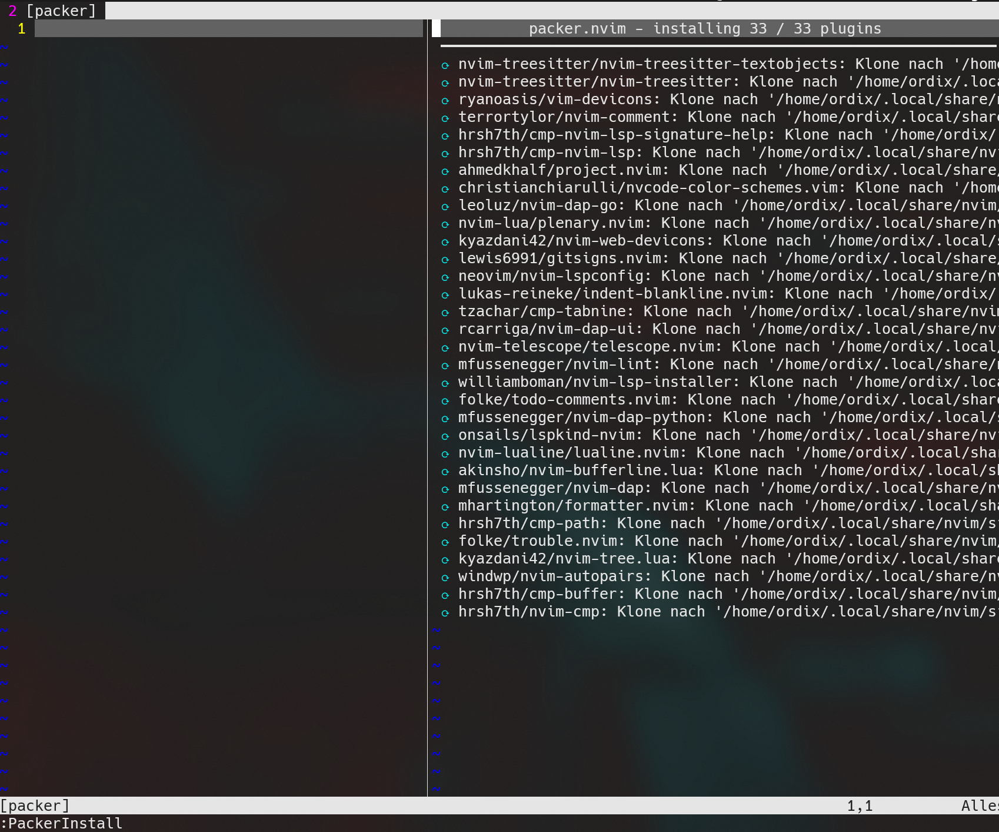
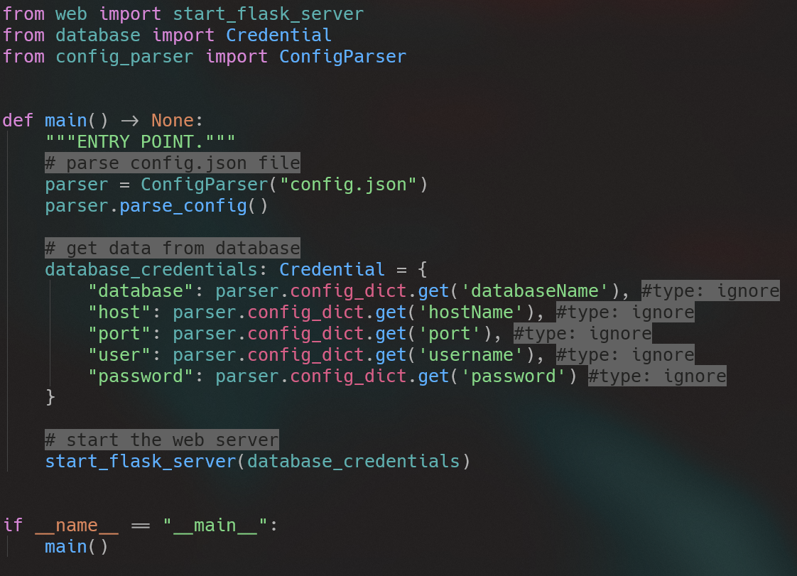
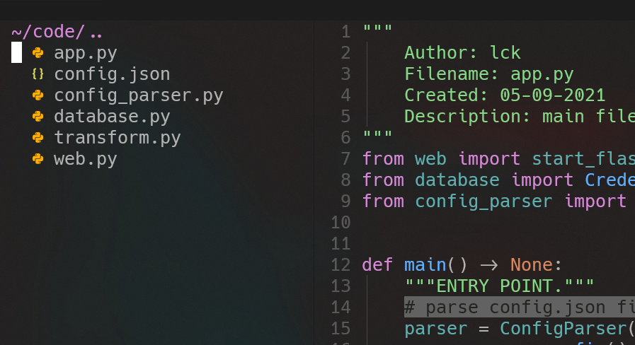
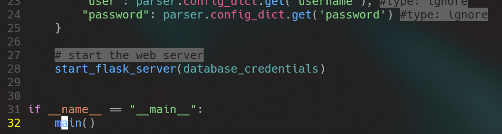

# Neovim Workshop

## 0. Get the perfect font (not required)
1. Download the font [Click me](https://github.com/pyrho/hack-font-ligature-nerd-font/blob/master/font/Hack%20Regular%20Nerd%20Font%20Complete%20Mono.ttf)
2. Open the file and click install
3. Open your Terminal and change font to `Hack Nerd Font Mono`

## 1. Get on the system
1. Groups of 2
2. Login credentials are written on the paper in front of you. (Please don't move them)
3. Open your Terminal (Windowsterminal -> Powershell or WSL)
3. Login into ssh
    ```bash
    $ ssh <user-from-paper>@<ip-from-paper>
    ```

## 2. Initial Login
1. Open Neovim for the first time. (This can take some time)
    ```bash
    $ nvim
    ```
2. Press enter to skip the Warning about the colortheme.
3. Press `:` on your keyboard. Then type PackerInstall in the opened text input on the left bottom of your screen.
4. Press Enter. A window split should open up.(Errors are normal)
    
5. Wait until the header changes to `packer.nvim - finished in ...`
    * Don't care about the erros. The are fixed automatically when reopening nvim.
6. Close the window split press `q` on your keyboard.
7. Leave nvim type `:q`

## 3. Open some code
1. Enter the following command in your terminal: `nvim ~/code/app.py`
    * Skip the following warning by pressing enter. This will be fixed automatically.
2. Wait some time till `4/4 Treesitter parser for python has been installed`.
3. Restart nvim with `:q` and `nvim ~/code/app.py`.
    * After restarting syntax highlighting should be applied.
    

## 4. General information
* Normal mode (moving arround like a god but not allowed to write)
    * Is active when `NORMAL` is displayed in the statusline at the bottom.
    * You can always switch to NORMAL mode pressing: `ESC`

* Insert mode (writing like goethe but not allowed to move arround)
    * Is active when `INSERT` is displayed in the statusline at the bottom.
    * You can always switch from NORMAL to INSERT mode pressing: `i`
    * ⚠ Reminder: `ESC` gets you back to NORMAL mode

* You can move the cursor using the following keys (NORMAL mode only):
    * `h` -> left
    * `j` -> down
    * `k` -> up
    * `l` -> right

## 5. Working with Neovim
### 5.1 Working with the file explorer
* With in neovim press `SPACE e`. You need to press them both at the same time, but SPACE must be one milisecond faster. Otherwise the order will be `e SPACE` which is wrong.
* A new window split should be opened.
    
* In the previous picture you can spot a cursor in the left top corner. That shows you are focusing the file explorer window. Which is needed. If this is not the case you can click with your mouse inside the tree window. 
* With the keys you can navigate up and down.
    * `j` -> down
    * `k` -> up
* To open a file simply press `v` (vertical split) with the cursor on that specific file.
    * ⚠ if you split the file `app.py` nothing will happen because it is already opened.

* To close the file explorer just do `SPACE e` again.

* The file tree can do a lot more. Copy, rename, delete, create a file and even move through your entire file system. Also horizontal splits are possible. If you wan't to learn more you can visit [Dotfiles](https://github.com/LucaKuechler/Dotfiles/blob/master/cheat/.config/cheat/nvim/nvim_tree)

### 5.2 Move through the window splits
* `gl` -> go into right split
* `gh` -> go into left split
* `gj` -> go one split down (needs at least one horizontal split)
* `gk` -> go one split up (needs at least one horizontal split)

### 5.3 Resize Splits
* `STRG l` -> decrease focused window size
* `STRG h` -> increase focused window size

### 5.4 Close Split
* `STRG w` -> close current focused split

### 5.5 Search files in the current workspace
* `SPACE SPACE` -> open file search field

### 5.6 Search words in the current workspace
* `SPACE g` -> open file search field

### 5.7 Language server features
* Because the language Server has been installed after you open your nvim the last time, please re open the app.py file:
	1. Type `:qa!` to exit neovim
	2. open neovim again by typing `nvim ~/code/app.py`

#### 5.7.1 Go to definition
* Click or move to a function call (use a function that is written by me)
    
* Press `gd` -> goto definition

#### 5.7.2 Rename symbol using the language server
* Navigate to the function call `main()` in `app.py` and place your cursor on the word.
* Press `SPACE l r` -> this opens a rename window at the bottom of your editor. Choose any name and press enter.
    * In a real dev environment the language server would also rename each instance of main() in other files of the project.

### 5.8 Autocompletion
1. Go into any line of the code. Press `i` to enter the INSERT mode.
2. Now type `if __name` and press `STRG n` to select the next option.
3. Even if the menus still shows you can just press enter.
