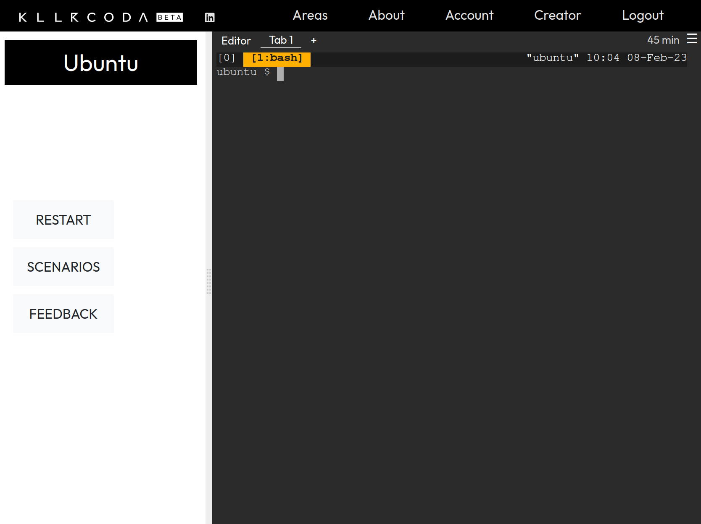
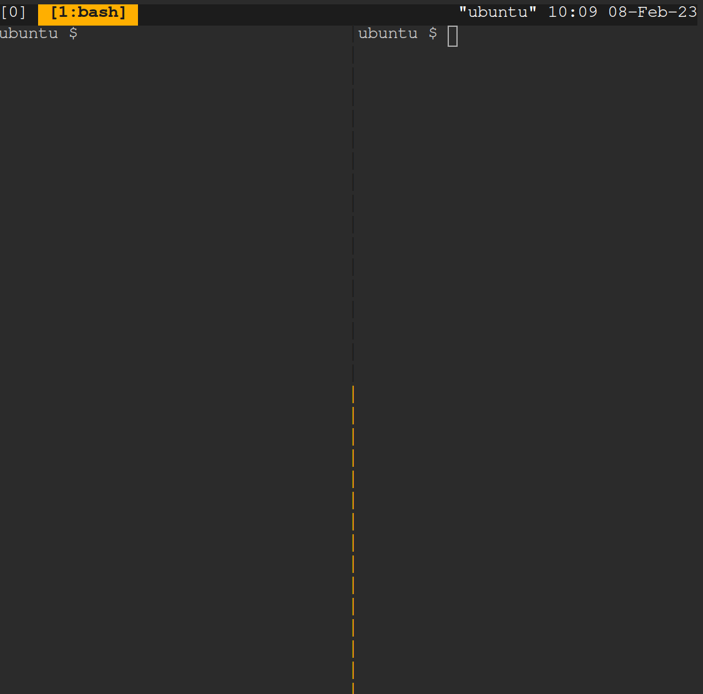
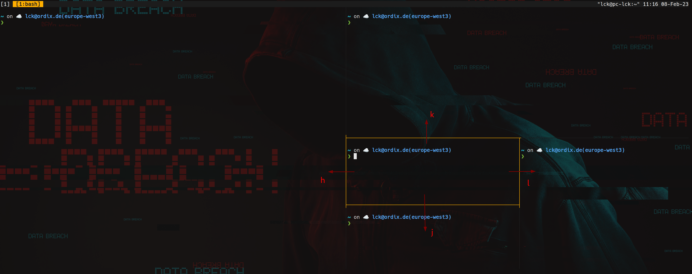
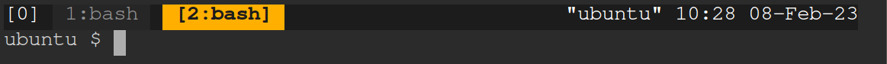
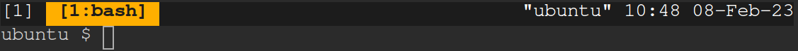
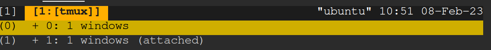
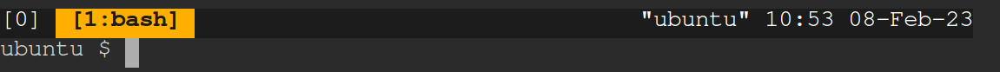

# Tmux Workshop 2023 SpringCamp

## 1. Get on the system
> Killercoda is a online plattform that offers interactive linux environments in the browser.
You can use them for free but your changes are only stored for one hour or till you reload the page.
1. Visit [Killercoda](https://killercoda.com/playgrounds/scenario/ubuntu)
2. Sign in using Google, Github, Gitlab or Email
3. Click **START**
&nbsp;

&nbsp;
## 2. Get to know the environment 
&#11088; you can skip this step if you familiar with linux shells

1. Enter the following command and press `ENTER`. The answer should be **root**.
    ```bash
    whoami
    ```

2. Change into your home directory
    ```bash
    cd /root
    ```
&nbsp;

## 3. Get my tmux config
* Execute the following command inside the killercoda linux shell. This will download the configuration file from my github and place it in your home directory.
    ```bash
    wget https://raw.githubusercontent.com/LucaKuechler/Dotfiles/master/tmux/.tmux.conf -P ~/
    ```

* Enter the following command in your shell
    ```bash
    tmux
    ```

* Your shell should now look like this.

&nbsp;

## 4. Create your first split
* To split the window vertically use `STRG + SPACE` + `t`


* If you type something it should appear in the right split.
To get back to the left split just press `STRG + SPACE` + `h`.

* The controls are similar to the keys for moving arround in vim. 
    * UP -> `STRG + SPACE` + `k`
    * DOWN -> `STRG + SPACE` + `j`
    * LEFT -> `STRG + SPACE` + `h`
    * RIGHT -> `STRG + SPACE` + `l`

* This image might help you.


* Create your first horizontal split using `STRG + SPACE` + `-`.

* **Challenge**: Try to move up from your created horizontal split.

* You can close a split by typing `exit`.
&nbsp;

&nbsp;
## 5. Create your first window
* To create a new window use `STRG + SPACE` + `w`. It should look like this.


* Switch back to window 1 by using `STRG + SPACE` + `1`.
You can switch to each window by using the number infront of their name.

* **Challenge**: Create a horizontal split in the window with the number 2.

* You can temporarily maximize the current selected pane by using `STRG + SPACE` + `z`.
To leave the maximize mode just press `STRG + SPACE` + `z` again.
&nbsp;

&nbsp;
## 6. Create a new session
> A new session can be used when working on two projects simultaneously. 

* To create a new session first detach from the current session using `STRG + SPACE` + `d`.
Your shell should show something like **[detached (from session 0)]**. After that execute
the following command in your shell.
    ```bash
    tmux
    ```

* The session number in the top left should now change from zero to one.
If the number is higher don't worry about it.


* To change between session use `STRG + SPACE` + `s`. A session menu should open up.
Use the j key to navigate down and k to navigate up. To confirm your selection press
`ENTER`.

* **Challenge**: Change to the session 0.
    * Before `ENTER`
    
    * After `ENTER`
    
&nbsp;

## 7. The special power
1. Execute the command `sleep 10000` that will make your terminal freeze for 10000 seconds.
This should simulate a long download from the internet. Don't worry we interrupt it later on.

2. Simulate a VPN Connection crash or exedentially closing the terminal window by 
pressing `STRG + SPACE` + `d`. If you try the steps local you can actually close the terminal window.

3. Your shell should show something like **[detached (from session 0)]**. If the number is not 0
then remember to change back to the session with the number that is shown to u after the step 4. 

4. Execute the command `tmux attach` in your shell. Your tmux should now show the sleep command
again which means the download is still running.

5. For the people with a session number different than 0 change now back to your session number.

6. Interrupt the sleep now using `STRG + c`

7. &#127881; Well done. For more features you can look up my [cheatsheet](https://github.com/LucaKuechler/Dotfiles/blob/master/cheat/.config/cheat/tmux/tmux_general) or this [talk](https://www.youtube.com/watch?v=JhKXOYepX2E).
